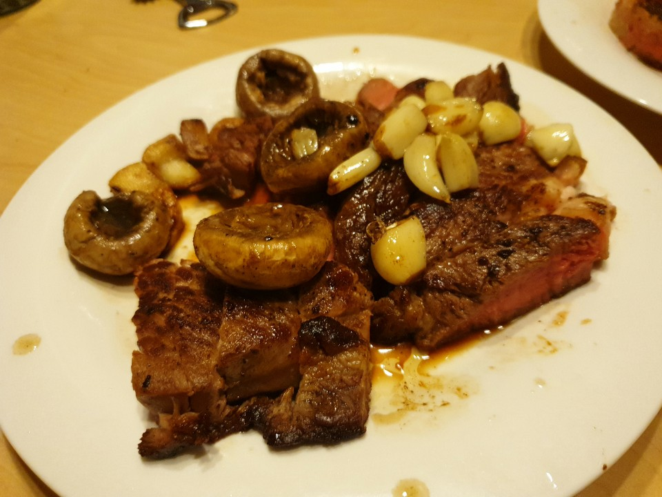
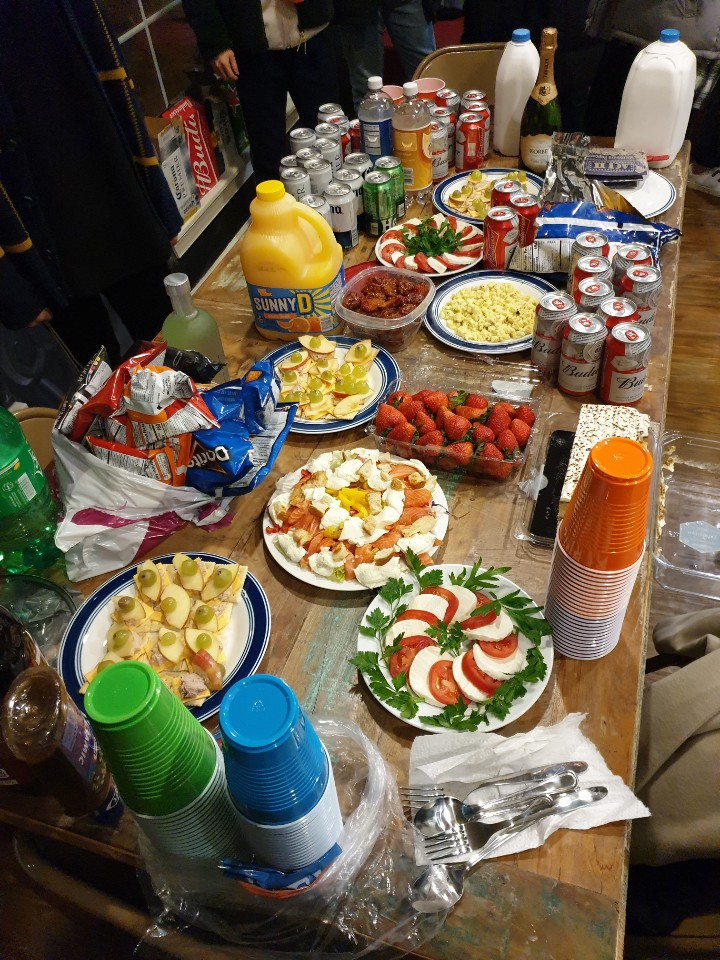

##### 19.12.31

10:00 Purdue University의 K-Square에 갔다. 건물이 다 예뻤다.

12:00 교내에 있는 Pizza 가게에 갔다. 빵이 부드럽고 맛있었다. 하지만 짜고 느끼했다.

15:00 walmart에서 한번 더 장을 봤다. 오늘 밤의 파티를 위해 연어 크루통 샐러드의 재료를 샀다.

18:00 장보면서 샀던 Ribeye를 요리했다. 우리말로 꽃등심이라고 한다. 나름 잘 만든 것 같다. 되게 맛있었다.

21:00 Happy New Year Party를 위해 숙소 중앙의 Club House에 갔다. 사람도 많고 음식도 많았다. 다른 학교 사람들과도 친해질 수 있었다.

24:00 Indianapolis는 미국동부시와 같은 Timezone이기 때문에 뉴욕 Time Square Countdown과 동시에 해피뉴이어를 축하했다. 즐거웠다.

> 이 날의 목표는 1월 1일 Allday Hangover였다.. 글을 쓰는 지금보니 성공적으로 달성했다. 윽

